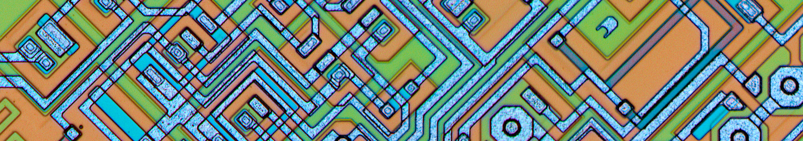

# Welcome to SystemRDL!
Welcome to the SystemRDL open source community space! [^1]

The goal for this GitHub organization is to build high-quality free and
open-source tools for control & status register (CSR) automation, and to
promote [Accelera's SystemRDL](https://www.accellera.org/downloads/standards/systemrdl)
as the language of choice for CSR design entry.

## PeakRDL Command Line Application
Don't want to develop any scripts? Here is a ready-to-use command-line tool that
bundles all of the PeakRDL toolchain together.

See the [PeakRDL Documentation](http://peakrdl.readthedocs.io) for more details.

## Individual PeakRDL Components
If the command line tool isn't your style, you can use the PeakRDL components
individually. Each component is installable as a separate Python package and has
a documented API you can use to integrate it into your own custom workflow.

* [PeakRDL-regblock](https://peakrdl-regblock.readthedocs.io) generates synthesizable SystemVerilog RTL.
* [PeakRDL-html](https://github.com/SystemRDL/PeakRDL-html/blob/main/README.md) produces intuitive and dynamic HTML documentation.
* [PeakRDL-UVM](https://github.com/SystemRDL/PeakRDL-uvm/blob/main/README.md) generates a UVM register model.
* [PeakRDL-ipxact](https://peakrdl-ipxact.readthedocs.io) lets you import and export IP-XACT XML.

## SystemRDL language front-end compiler
Need to build something custom? Use the SystemRDL compiler front-end to handle
all the heavy-lifting of processing the SystemRDL language.

[^1]: This SystemRDL GitHub group is not affiliated with Accelera
